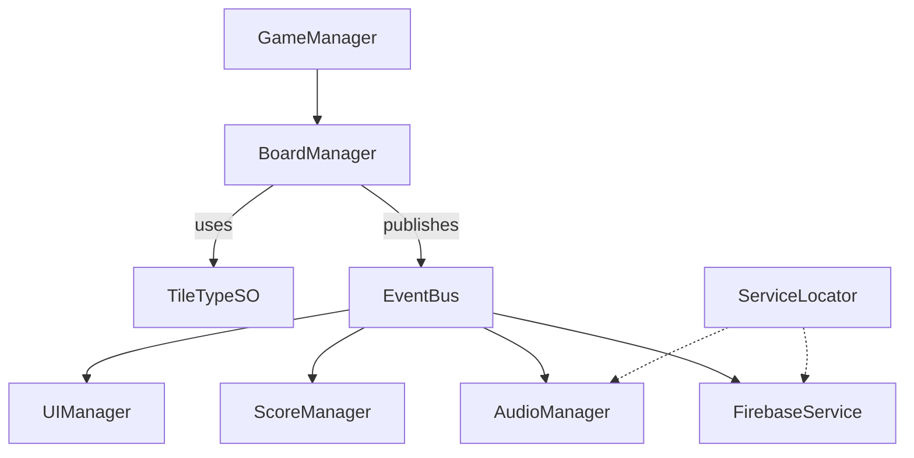

# Match3Portfolio

## 🎯 Project Overview

**Match3Portfolio** is a modular, cleanly-architected Match-3 puzzle game developed in Unity as a professional portfolio project.  
The project’s goal is to demonstrate modern Unity development practices, modular game architecture, and a scalable codebase with extensibility in mind.

## 🚀 Why Did I Build This Project?

- To **demonstrate strong Unity architecture** principles in a real-world scenario.
- To show my ability to plan, structure, and implement a clean and scalable game project.
- To create a foundation that is easily extendable for advanced features (like power-ups, chained tiles, boosters, etc.).
- To showcase best practices in mobile game development, UI, optimization, and data-driven design.
- To serve as a “showcase-ready” example for potential employers, freelance clients, and collaborators.

## 🧩 Core Features (MVP Scope)

- Fully playable Match-3 puzzle gameplay (swap, match, clear, refill).
- Data-driven tile and level configuration using ScriptableObjects.
- Modular architecture with clear separation of concerns.
- Event-driven system for UI, score, audio, and game logic communication.
- Simple state machine for game flow (start, playing, animation, game over).
- Responsive and mobile-friendly UI (Canvas scaling, Safe Area, etc.).
- Basic sound effects and UI animations.
- Clean and readable codebase, commented and ready for further extension.

## 🏗️ Architecture & Patterns Used

**This project was built using modern, professional architecture principles:**

### 1. ScriptableObject Pattern
- All tile types and level configs are defined as ScriptableObjects.
- Allows content to be created and balanced directly in the Unity Editor, supporting data-driven design.

### 2. State Machine
- Central `GameManager` maintains the game flow using simple state management (`Idle`, `PlayerInput`, `Animating`, `GameOver`).
- Reduces complexity in the main game loop.

### 3. Event-Driven (Observer/Event Bus)
- Decoupled communication between game systems (BoardManager, UI, Score, Audio).
- Makes the code modular, testable, and easy to expand.

### 4. Service Locator
- AudioManager, FirebaseService, and other managers are accessible via a loose-coupling service locator.
- Enhances testability and supports dependency injection for future features.

### 5. MVC-Inspired UI Layering
- UI logic, game logic, and data are separated for maintainability and clean code.

### 6. Asset Management
- Organized folders for scripts, prefabs, art, configs, UI, and addressables.
- Designed with mobile optimization in mind (sprite atlas, batching).

---

## 📐 Project Architecture Diagram

---

## ✨ Extensibility & Future Work
- Special tiles (chained, frozen, locked, etc.)
- Boosters (bomb, rocket, disco ball, etc.)
- Multiple game modes and progression
- Online leaderboards and user profiles (Firebase)
- Advanced visual effects (shader-based, addressables, etc.)

**This project is published solely for demonstration and portfolio purposes.**
