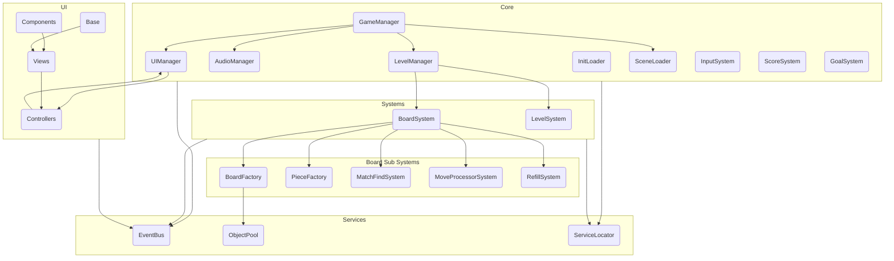

# Fruity Bat

## 🎮 Let's Play
[Fruity Bat - Play on itch.io](https://berckhart.itch.io/fruity-bat)

## 🎯 Project Overview

**Fruity Bat** is a modular, cleanly-architected Match-3 puzzle game developed in Unity as a professional portfolio project.  
The project’s goal is to demonstrate modern Unity development practices, modular game architecture, and a scalable codebase with extensibility in mind.

## 🧩 Core Features (MVP Scope)

- Fully playable Match-3 puzzle gameplay (swap, match, clear, refill).
- Data-driven tile and level configuration using ScriptableObjects.
- Modular architecture with clear separation of concerns.
- Event-driven system for UI, score, audio, and game logic communication.
- Simple state machine for game flow (start, playing, animation, game over)..
- Clean and readable codebase, commented and ready for further extension.
- Managing prefabs with object pooling

### UML Diagram

### 🔧 Custom Editor Tool
Key features of the tool:
- Visual Board Editor: Allows for easy creation of the game board by simply clicking on a visual grid. 
- Flexible Ground Types: Define any cell with one click as a 'Normal' tile, a 'Hole', or a 'Generator'. 
- Rich Content Types: Populate cells with 'Random' or 'Specific' Gems, 'Obstacles', or 'Power-ups'. 
- Overlay System: Add extra layers of complexity, like 'Ice', on top of existing items to create more diverse challenges.

## ✨ Extensibility & Future Work
- Special tiles (chained, frozen, locked, etc.)
- Boosters (bomb, rocket, disco ball, etc.)
- Online leaderboards and user profiles (Firebase)

**This project is published solely for demonstration and portfolio purposes.**
